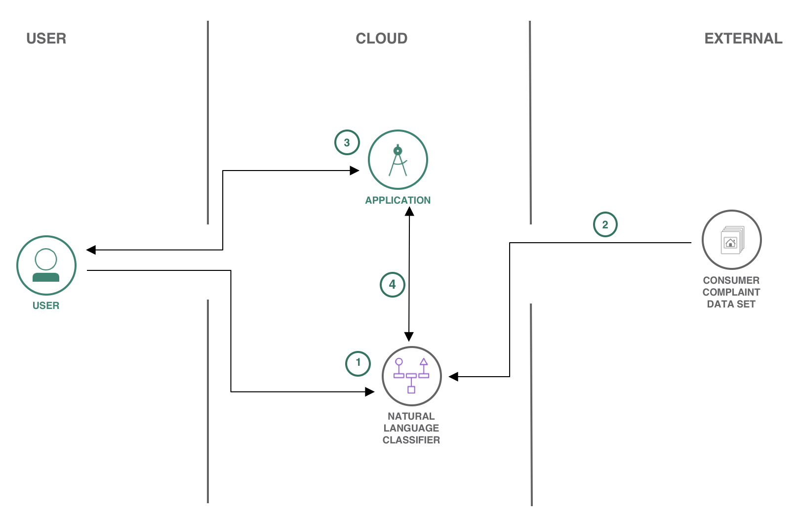

# Technical Support ticket classification using Watson Natural Language Classifier

In this Code Pattern, we will build an app that classifies various consumer complaint support tickets. We'll be using IBM Watson Natural Language Classifier (NLC) to train a model using [consumer complaint dataset](https://www.consumerfinance.gov/data-research/consumer-complaints/#download-the-data). Please note that this data is free to use for non-commercial use, and explicit permission must be obtained otherwise. The custom NLC model can be quickly and easily built in the Web UI, deployed into our nodejs app using the [Watson Developer Cloud Nodejs SDK](https://github.com/watson-developer-cloud/node-sdk), and then run from a browser.

When the reader has completed this Code Pattern, they will understand how to:

* Build a [Watson Natural Language Classifier](https://www.ibm.com/watson/services/natural-language-classifier/) model using the Web UI.
* Create a Node js app that utilizes the NLC model to classify collection of consumer complaint support ticket text into various categories.
* Use the Watson Developer Cloud SDK for nodejs.



## Flow

1. User interacts with Natural Language Classifier (NLC) GUI to train the model.
2. [Consumer complaint support ticket Dataset](https://github.com/IBM/support-ticket-classification/tree/master/docs/training_data) is loaded to the NLC service for training.
3. User uploads excel file (having .csv extension) with test data to have it classified.
4. App uses Watson Natural Language Classifier to classify the collection to mortgage, banking, loans or credit card related support tickets.

## Included components

* [Watson Studio](https://www.ibm.com/cloud/watson-studio): Analyze data using RStudio, Jupyter, and Python in a configured, collaborative environment that includes IBM value-adds, such as managed Spark.
* [Watson Natural Language Classifier](https://www.ibm.com/watson/services/natural-language-classifier/): An IBM Cloud service to interpret and classify natural language with confidence.

## Featured technologies

* [Artificial Intelligence](https://medium.com/ibm-watson): Artificial intelligence can be applied to disparate solution spaces to deliver disruptive technologies.
* [Data Science](https://medium.com/ibm-watson): Systems and scientific methods to analyze structured and unstructured data in order to extract knowledge and insights.
* [Node.js](https://nodejs.org/): An open-source JavaScript run-time environment for executing server-side JavaScript code.

# Steps

1. [Clone the repo](#1-clone-the-repo)
1. [Create Watson NLC service with IBM Cloud](#2-create-watson-nlc-service-with-ibm-cloud)
1. [Train the NLC model](#3-train-the-nlc-model)
1. [Configure credentials](#4-configure-credentials)
1. [Run the application](#5-run-the-application)

### 1. Clone the repo

Clone the `support-ticket-classification` locally. In a terminal, run:

```
$ git clone https://github.com/IBM/support-ticket-classification.git
```

### 2. Create Watson NLC service with IBM Cloud

* Create [Watson Studio](https://console.bluemix.net/catalog/services/watson-studio) service in your IBM Cloud account.

* In Watson Studio service create a New Project by clicking the `New Project` tile or use `+ New project`:


* Under the `Settings` tab, scroll down to `Associated services`, click `+ Add service` and choose `Watson`:


* Find the `Natural Language Classifier` tile and click `Add`.

> Note: the `Standard` plan allows free usage before billing begins:

```
1 Natural Language Classifier free per month.
1000 API calls free per month
4 Training Events free per month
```

* Give the NLC service a name. This name will be used later if you `Deploy to IBM Cloud` when you add the service under `Connections`.

* Once the service is created the `Credentials` will be on the page. Click `Show` to make them visible and copy them for later use when you [Configure credentials](#4-configure-credentials). You can always get to the credentials by clicking the `Service credentials` on the left.

### 3. Train the NLC model

* In your project, under the `Assets` tab and `Models` click `+ New Natural Language Classifier model` to bring up the `New Classifier` GUI page:


* Add the data to your project by clicking the `Browse` button in the right-hand `Upload to project` section and browsing to this repo. Choose `support-ticket-classification/docs/training_data/Bank_Accounts.csv`, `support-ticket-classification/docs/training_data/credit_card_tickets.csv`, `support-ticket-classification/docs/training_data/loans.csv` and `support-ticket-classification/docs/training_data/Mortgage.csv`

* Drag and drop all the csv files you uploaded to the `Create a Class` box:


* Click the `Train model` button to begin training. The model will take around an hour to train.

* To check the status of the model, and access it after it trains, go to your project in the `Assets` tab of the `Models` section. The model will show up when it is ready. Double click to see the `Overview` tab.


* The `Overview` tab top line has the `ModelID`. Click the copy icon and save this for the [Configure credentials](#4-configure-credentials) step.

* Click the `Test` tab and enter a phrase from the data to test the classifier. For example, "I send my credit card payment on time every month and they charge me fees in the form of interest, I have contacted them once before and they said it would not happen again, it has happened again and they charge finance charges" is classified as "Billing disputes".

* Click the `Implementation` tab to see how to use the classifier with Curl, Java, Node, or Python.

### 4. Configure credentials

The credentials for all IBM Cloud services (Natural Language Classifier), can be found in the ``Services`` menu in IBM Cloud, by selecting the ``Service Credentials`` option for each service.
The `CLASSIFIER_ID` is the `ModelID` from [step 3](#3-train-the-nlc-model) above.

Copy the [`env.example`](env.example) to `.env`.

```
$ cp env.sample .env
```
Edit the `.env` file with the necessary settings. If the credentials are IAM API Key & IAM URL instead of username and password, then you will have to uncomment that field from .env file and comment username/password before running npm start

#### `env.sample:`

```
# REPLACE CREDENTIALS WITH YOUR NATURAL LANGUAGE CLASSIFIER CREDENTIALS
# Rename this file to .env before running 'npm start'.

watson_nlc_url= https://gateway.watsonplatform.net/natural-language-classifier/api
watson_nlc_classifier_id=<Add model id>
# You need to provide either username and password
# watson_nlc_username=<Add NLC Username>
# watson_nlc_password=<Add NLC Password>

# OR IAM API key and URL
watson_nlc_iam_apikey=<Add NLC API key>

```

### 5. Run the application

You can either ``Deploy to IBM Cloud`` button **OR** create the services and run locally.

#### Deploy to IBM Cloud

[](https://bluemix.net/deploy?repository=https://github.com/IBM/support-ticket-classification.git)

1. To see the app and service created and configured for this Code Pattern, use the IBM Cloud dashboard. The app is named `support-ticket-classification` with a unique suffix.

1. You will need to add the `ModelID` from [step 3](#3-train-the-nlc-model) above and the NLC credentials from [Configure credentials](#4-configure-credentials) to the application. After accessing your app from the dashboard, click on ``Runtime`` on the menu and navigate to the ``Environment variables`` tab.

1. Replace `placeholder` for the `watson_nlc_classifier_id` and `watson_nlc_iam_apikey` variables with your `ModelID` and API Key,  and click `Save`.

Note: NLC API URL will change based on the region you have created the NLC service.


1. After saving the environment variables, the app will restart. After the app restarts you can access it from the URL at `Visit App URL`.

## Run locally

1. Install [Node.js](https://nodejs.org/en/) runtime or NPM.
1. Start the app by running `npm install`, followed by `npm start`.
1. Use the app at `localhost:3000`.

# Sample output


<!--
# Troubleshooting
-->

# Links

* [Watson Natural Language Classifier Demo](https://github.com/watson-developer-cloud/natural-language-classifier-nodejs)
* [Watson Node.js SDK](https://github.com/watson-developer-cloud/node-sdk)

# Learn more

* **Artificial Intelligence Code Patterns**: Enjoyed this Code Pattern? Check out our other [AI Code Patterns](https://developer.ibm.com/code/technologies/artificial-intelligence/).
* **Data Analytics Code Patterns**: Enjoyed this Code Pattern? Check out our other [Data Analytics Code Patterns](https://developer.ibm.com/code/technologies/data-science/)
* **AI and Data Code Pattern Playlist**: Bookmark our [playlist](https://www.youtube.com/playlist?list=PLzUbsvIyrNfknNewObx5N7uGZ5FKH0Fde) with all of our Code Pattern videos
* **With Watson**: Want to take your Watson app to the next level? Looking to utilize Watson Brand assets? [Join the With Watson program](https://www.ibm.com/watson/with-watson/) to leverage exclusive brand, marketing, and tech resources to amplify and accelerate your Watson embedded commercial solution.
* **Data Science Experience**: Master the art of data science with IBM's [Data Science Experience](https://datascience.ibm.com/)

# License
This code pattern is licensed under the Apache Software License, Version 2.  Separate third party code objects invoked within this code pattern are licensed by their respective providers pursuant to their own separate licenses. Contributions are subject to the [Developer Certificate of Origin, Version 1.1 (DCO)](https://developercertificate.org/) and the [Apache Software License, Version 2](http://www.apache.org/licenses/LICENSE-2.0.txt).

[Apache Software License (ASL) FAQ](http://www.apache.org/foundation/license-faq.html#WhatDoesItMEAN)